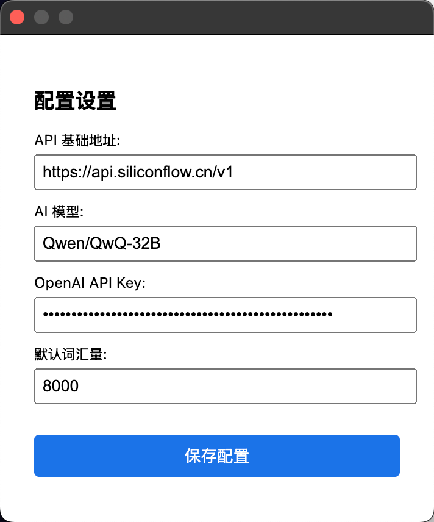

# YouTube 学习助手浏览器插件

## 背景

回顾自己的英语学习历程，我觉着最有收获，就是那段高频将自己浸泡在英语环境中的时期。但当时的主要痛点包括：

- 无法预判视频是否符合自己的英语水平
- 视频可能过于简单或过于困难
- 在关键词汇上的理解障碍影响整体理解
- 即使能大致理解内容，观看过程依然费力

## 功能介绍

针对以上问题，这款浏览器插件提供以下功能：

- 自动读取 YouTube 视频字幕
- 通过 AI 分析视频内容难度是否适合用户
- 提供重要词汇的简单解释，帮助用户更好理解视频内容
- 结合视频场景加深词汇掌握

欢迎感兴趣的朋友试用，并提供宝贵意见。

## 安装和使用说明

1. 下载 caption.zip 文件，并解压（当然你直接 clone 项目也行）
2. 打开插件管理页面（chrome://extensions/）并打开 developer mode

3. 点击页面左上角的 Load Unpacked，选择刚才解压的文件夹

4. 唤出插件配置弹窗

5. 配置好 API & model & API key & 词汇量
5.5  白嫖 API key:
    - 打开 https://siliconflow.cn/ 并注册，自动获得免费的 ¥14 余额
    - 注：非广，各大模型分发平台均有相关策略，可自行选择平台使用
    - 在插件配置页设置 API 地址为 `https://api.siliconflow.cn/v1` 
    - 设置你的 api key，见 [API 密钥页](https://cloud.siliconflow.cn/account/ak)；模型可自行选择，详见 [API 文档](https://docs.siliconflow.cn/cn/api-reference/chat-completions/chat-completions) 中的 `Available options`
6. 打开 YouTube 视频页，点击右上角的`词汇助手` button

7. Enjoy!（弹窗出来会加载若干秒，取决于 AI 本身响应速率）