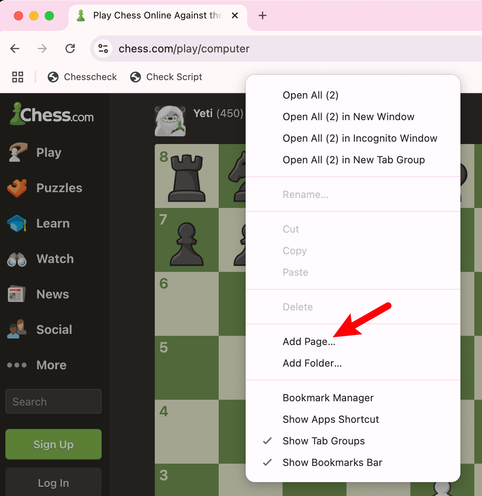
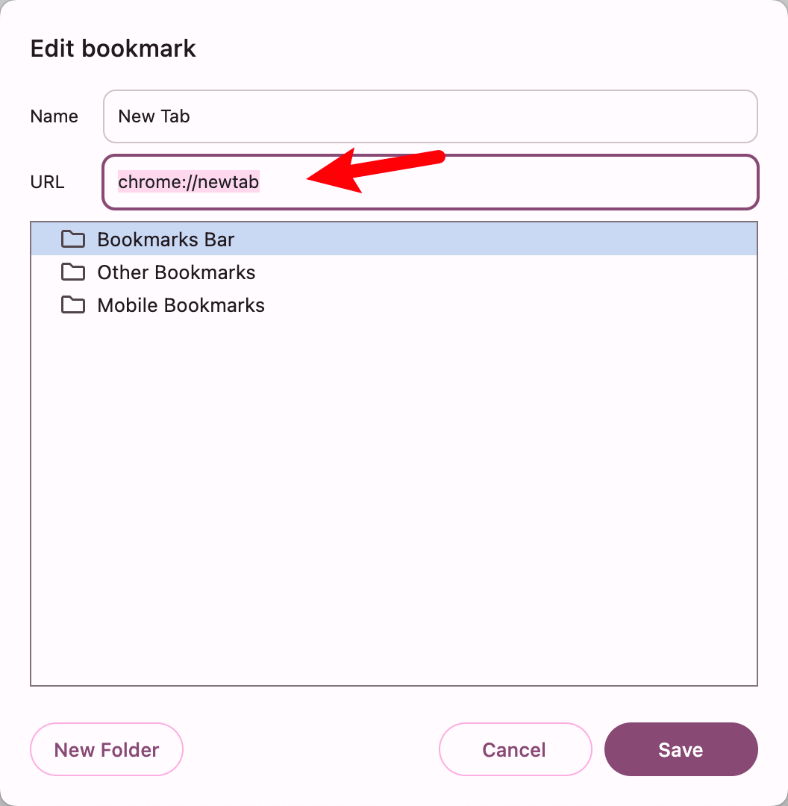

# A Chess Tool to Help You Avoid Blunders

## Background

We all know that to avoid blunders in chess, one crucial approach is to perform multiple checks: before making an actual move, we need to analyze our opponent's attacking intentions and confirm whether we have means of attack and counterattack.

However, playing rapid chess for a long time has led me to develop a bad habit of moving pieces before thinking, often completing moves before analyzing all possible variations. In this state, I frequently make basic mistakes and subsequently lose games.

To overcome this issue, I created a small tool: when it's your turn, this tool prevents you from controlling the chess pieces. You must complete six check items before you can operate the board. This way, I am forced to complete the checks before making a move. I've used this tool in my practice over the past two days and found it quite effective, so I'm sharing it with everyone, hoping it helps those who face similar struggles.

## Demo

<video width="320" height="240" controls>
    <source src="example.mov" type="video/mp4">
    Your browser does not support the video tag.
</video>

[Demo Video](example.mov)

## Preliminary Notes
* Currently only supports the web version of chess.com
  - If you want to use this tool on other websites, leave a comment below, and I'll work on compatibility support for other sites when time permits
* There might be minor bugs
  - Since I developed this tool casually, I'm not certain if it works perfectly in all scenarios. Therefore, I personally recommend using it only when playing against computers to avoid any unexpected situations that might affect your performance. (By the way, I think playing against computers is indeed a good way to develop the habit of checking before moving, as we don't need to worry about time constraints)

## Installation & Usage Instructions

> [Github Link](https://github.com/Ninglo/simple-scripts/tree/main/chessForceCheck)

### Chrome

#### 1. Copy the code below

```javascript
javascript:(function()%7B(function () %7B%0A  "use strict"%3B%0A%0A  let activeGame %3D false%3B%0A  let turnCounter %3D 0%3B%0A  let checksCompleted %3D 0%3B%0A  let isMyTurn %3D false%3B%0A  let waitingForEnter %3D false%3B%0A  let transparent %3D 0.3%3B%0A  let observer %3D undefined%3B%0A%0A  const checks %3D %5B%0A    "enemy's capture"%2C%0A    "enemy's check"%2C%0A    "enemy's attack"%2C%0A    "my capture"%2C%0A    "my check"%2C%0A    "my attack"%2C%0A  %5D%3B%0A%0A  %2F%2F 悬浮窗%0A  const floatWindow %3D document.createElement("div")%3B%0A  floatWindow.style.position %3D "fixed"%3B%0A  floatWindow.style.top %3D "10px"%3B%0A  floatWindow.style.right %3D "80px"%3B%0A  floatWindow.style.width %3D "200px"%3B%0A  %2F%2F floatWindow.style.height %3D "260px"%3B%0A  floatWindow.style.backgroundColor %3D "white"%3B%0A  floatWindow.style.border %3D "1px solid black"%3B%0A  floatWindow.style.padding %3D "10px"%3B%0A  floatWindow.style.zIndex %3D 10000%3B%0A  document.body.appendChild(floatWindow)%3B%0A%0A  const infoDiv %3D document.createElement("div")%3B%0A  floatWindow.appendChild(infoDiv)%3B%0A%0A  const transparentArea %3D document.createElement("div")%3B%0A  const transparencyLabel %3D document.createElement("label")%3B%0A  transparencyLabel.textContent %3D "Transparent%3A"%3B%0A  transparencyLabel.style.marginRight %3D "8px"%3B%0A%0A  const transparencyInput %3D document.createElement("input")%3B%0A  transparencyInput.type %3D "number"%3B%0A  transparencyInput.min %3D "0"%3B%0A  transparencyInput.max %3D "1"%3B%0A  transparencyInput.step %3D %60%24%7Btransparent%7D%60%3B%0A  transparencyInput.value %3D %60%24%7Btransparent%7D%60%3B%0A  transparencyInput.style.width %3D "48px"%3B%0A  transparencyInput.oninput %3D () %3D> %7B%0A    transparent %3D parseFloat(transparencyInput.value)%3B%0A    overlay.style.backgroundColor %3D %60rgba(0%2C 0%2C 0%2C %24%7Btransparent%7D)%60%3B%0A  %7D%3B%0A%0A  transparentArea.appendChild(transparencyLabel)%3B%0A  transparentArea.appendChild(transparencyInput)%3B%0A  floatWindow.appendChild(transparentArea)%3B%0A%0A  const startBtn %3D document.createElement("button")%3B%0A  startBtn.textContent %3D "Start"%3B%0A  startBtn.style.width %3D "48px"%3B%0A  startBtn.onclick %3D () %3D> %7B%0A    activeGame %3D true%3B%0A    waitingForEnter %3D true%3B%0A    updateFloatWindow()%3B%0A    blockMouseClicks()%3B%0A    startMutation()%3B%0A%0A    startBtn.style.display %3D "none"%3B%0A    transparentArea.style.display %3D "none"%3B%0A    stopBtn.style.display %3D "inline-block"%3B%0A  %7D%3B%0A%0A  const stopBtn %3D document.createElement("button")%3B%0A  stopBtn.textContent %3D "End"%3B%0A  stopBtn.style.width %3D "48px"%3B%0A  stopBtn.style.display %3D "none"%3B%0A  stopBtn.onclick %3D () %3D> %7B%0A    activeGame %3D false%3B%0A    updateFloatWindow()%3B%0A%0A    startBtn.style.display %3D "inline-block"%3B%0A    transparentArea.style.display %3D "block"%3B%0A    stopBtn.style.display %3D "none"%3B%0A    observer%3F.disconnect()%3B%0A  %7D%3B%0A%0A  const buttonArea %3D document.createElement("div")%3B%0A  buttonArea.style.marginTop %3D "8px"%3B%0A  buttonArea.appendChild(startBtn)%3B%0A  buttonArea.appendChild(stopBtn)%3B%0A  floatWindow.appendChild(buttonArea)%3B%0A%0A  const overlay %3D document.createElement("div")%3B%0A  overlay.style.position %3D "fixed"%3B%0A  overlay.style.top %3D "0"%3B%0A  overlay.style.left %3D "0"%3B%0A  overlay.style.width %3D "100vw"%3B%0A  overlay.style.height %3D "100vh"%3B%0A  overlay.style.zIndex %3D 9999%3B%0A  overlay.style.backgroundColor %3D %60rgba(0%2C 0%2C 0%2C %24%7Btransparent%7D)%60%3B%0A  overlay.style.display %3D "none"%3B%0A  document.body.appendChild(overlay)%3B%0A%0A  %2F%2F 更新信息%0A  function updateFloatWindow() %7B%0A    infoDiv.innerHTML %3D %60%0A      <p style%3D"margin%3A 0">Current status%3A %24%7B%0A        activeGame %3F "Gaming" %3A "Stopped"%0A      %7D<%2Fp>%0A      <p style%3D"margin%3A 0">Current turn%3A %24%7BturnCounter%7D<%2Fp>%0A      <p style%3D"margin%3A 0">Checklist%3A%0A        <br%2F>%0A        <span style%3D"font-size%3A 1.2rem%3Bcolor%3A %23c4c3c3%3B">(press Enter to next)<%2Fspan>%0A      <%2Fp>%0A      <ul style%3D"margin%3A 0">%0A        %24%7Bchecks%0A          .map((check%2C index) %3D> %7B%0A            let status %3D ""%3B%0A            if (index < checksCompleted) %7B%0A              status %3D " ✅"%3B%0A            %7D else if (index %3D%3D%3D checksCompleted) %7B%0A              status %3D " ⏳"%3B%0A            %7D%0A            return %60<li>%24%7Bcheck%7D%24%7Bstatus%7D<%2Fli>%60%3B%0A          %7D)%0A          .join("")%7D%0A      <%2Ful>%0A      %60%3B%0A  %7D%0A%0A  %2F%2F 阻止鼠标点击%0A  function blockMouseClicks() %7B%0A    overlay.style.display %3D "block"%3B%0A    prepareCheckStep()%3B%0A  %7D%0A%0A  %2F%2F 解除阻止%0A  function unblockMouseClicks() %7B%0A    overlay.style.display %3D "none"%3B%0A  %7D%0A%0A  %2F%2F 等待 0.2 秒后，等待Enter确认%0A  function prepareCheckStep() %7B%0A    if (checksCompleted < checks.length) %7B%0A      waitingForEnter %3D false%3B%0A      setTimeout(() %3D> %7B%0A        waitingForEnter %3D true%3B%0A      %7D%2C 200)%3B%0A    %7D else %7B%0A      unblockMouseClicks()%3B%0A    %7D%0A  %7D%0A%0A  %2F%2F 按下Enter后进行下一检查%0A  document.addEventListener("keydown"%2C (e) %3D> %7B%0A    console.log("enter"%2C e.key%2C waitingForEnter)%3B%0A    if (e.key %3D%3D%3D "Enter" %26%26 waitingForEnter) %7B%0A      checksCompleted%2B%2B%3B%0A      updateFloatWindow()%3B%0A      prepareCheckStep()%3B%0A    %7D%0A  %7D)%3B%0A%0A  %2F%2F 为DOM变化添加防抖%0A  function debounce(fn%2C delay) %7B%0A    let timer%3B%0A    return (...args) %3D> %7B%0A      clearTimeout(timer)%3B%0A      timer %3D setTimeout(() %3D> fn(...args)%2C delay)%3B%0A    %7D%3B%0A  %7D%0A%0A  const handleMutation %3D debounce(() %3D> %7B%0A    if (!activeGame) return%3B%0A    isMyTurn %3D !isMyTurn%3B%0A    if (isMyTurn) %7B%0A      turnCounter%2B%2B%3B%0A      checksCompleted %3D 0%3B%0A      updateFloatWindow()%3B%0A      blockMouseClicks()%3B%0A    %7D%0A  %7D%2C 500)%3B%0A%0A  function startMutation() %7B%0A    const targetNode %3D document.querySelector(%0A      ".play-controller-moves-container"%0A    )%3B%0A    if (targetNode) %7B%0A      observer %3D new MutationObserver(handleMutation)%3B%0A      observer.observe(targetNode%2C %7B childList%3A true%2C subtree%3A true %7D)%3B%0A      return observer%3B%0A    %7D%0A  %7D%0A%7D)()%3B%7D)()%3B
```

#### 2. Add a bookmark

1. Open the bookmarks bar
2. Right-click on an empty space in the bookmarks bar, select 'Add page'

3. Name the bookmark and paste the copied code into the URL field


#### 3. Execute the code

1. Open chess.com and start a game
2. Click on the bookmark you just added
3. Click the start button in the floating window in the top right corner

<video width="320" height="240" controls>
    <source src="full-example.mov" type="video/mp4">
    Your browser does not support the video tag.
</video>

[Full Example Video](full-example.mov)

#### 4. Play

After completing each check, press Enter to proceed to the next check. Once all checks are completed, you will be able to freely operate the board.

### Other Browsers

**I haven't tested if this tool works in other browsers. If you encounter any issues, feel free to leave a message and ask me.**

## End

If you find this tool helpful, please consider [Buy me a coffee](https://buymeacoffee.com/jiujianian), thank you!


