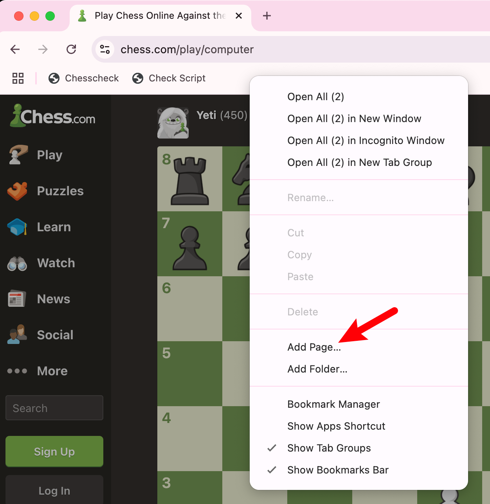

# 一个能辅助你避免 blunder 的象棋工具

## 背景介绍

我们都知道，想要避免下棋时出现 blunder，一个很重要的方式是多做检查：在真正落子之前，我们首先需要分析敌方的攻击意图，以及确认我方是否有攻击和反击的手段。但长期下快棋导致我培养出了落子先于思考的不好习惯，总是在思考完所有的变化之前就完成了落子。在这样的状态下，我总是出现一些低级的错误，进而输掉比赛。

为了克服这个问题，我做了一个小工具：在每一次轮到自己回合时，此工具会阻止用户操控棋盘棋子。需要先完成六个检查事项之后，才可以操作页面。如此一来，我就不得不就逼迫自己首先完成检查，然后再落子。我在最近两天的练习中使用了这个工具，发现效果还不错，因此分享给大家，希望对那些同样困扰于此的朋友有所帮助。

## 演示

<video width="320" height="240" controls>
    <source src="example.mov" type="video/mp4">
    Your browser does not support the video tag.
</video>

## 一些前置说明
* 当前仅支持 chess.com 的网页版
  - 如果你想在其他网站也使用这个工具，可以下方留言，我有时间会为其他网站也做兼容性支持
* 可能会有小 bug
  - 因为这个工具是我随手开发的，所以并不确定它是否能在所有的场景下都完美使用。所以我个人建议大家最好只在与电脑对战时使用该工具，避免出现一些意外情况，影响大家的成绩。（顺便我觉得与电脑对战确实是一个培养落子前预先检查的好方法，因为我们完全不需要担心时间的问题）

## 安装 & 使用说明

### Chrome

#### 1. 复制下方代码

```javascript
javascript:(function()%7B(function () %7B%0A  "use strict"%3B%0A%0A  let activeGame %3D false%3B%0A  let turnCounter %3D 0%3B%0A  let checksCompleted %3D 0%3B%0A  let isMyTurn %3D false%3B%0A  let waitingForEnter %3D false%3B%0A  let transparent %3D 0.3%3B%0A  let observer %3D undefined%3B%0A%0A  const checks %3D %5B%0A    "enemy's capture"%2C%0A    "enemy's check"%2C%0A    "enemy's attack"%2C%0A    "my capture"%2C%0A    "my check"%2C%0A    "my attack"%2C%0A  %5D%3B%0A%0A  %2F%2F 悬浮窗%0A  const floatWindow %3D document.createElement("div")%3B%0A  floatWindow.style.position %3D "fixed"%3B%0A  floatWindow.style.top %3D "10px"%3B%0A  floatWindow.style.right %3D "80px"%3B%0A  floatWindow.style.width %3D "200px"%3B%0A  %2F%2F floatWindow.style.height %3D "260px"%3B%0A  floatWindow.style.backgroundColor %3D "white"%3B%0A  floatWindow.style.border %3D "1px solid black"%3B%0A  floatWindow.style.padding %3D "10px"%3B%0A  floatWindow.style.zIndex %3D 10000%3B%0A  document.body.appendChild(floatWindow)%3B%0A%0A  const infoDiv %3D document.createElement("div")%3B%0A  floatWindow.appendChild(infoDiv)%3B%0A%0A  const transparentArea %3D document.createElement("div")%3B%0A  const transparencyLabel %3D document.createElement("label")%3B%0A  transparencyLabel.textContent %3D "Transparent%3A"%3B%0A  transparencyLabel.style.marginRight %3D "8px"%3B%0A%0A  const transparencyInput %3D document.createElement("input")%3B%0A  transparencyInput.type %3D "number"%3B%0A  transparencyInput.min %3D "0"%3B%0A  transparencyInput.max %3D "1"%3B%0A  transparencyInput.step %3D %60%24%7Btransparent%7D%60%3B%0A  transparencyInput.value %3D %60%24%7Btransparent%7D%60%3B%0A  transparencyInput.style.width %3D "48px"%3B%0A  transparencyInput.oninput %3D () %3D> %7B%0A    transparent %3D parseFloat(transparencyInput.value)%3B%0A    overlay.style.backgroundColor %3D %60rgba(0%2C 0%2C 0%2C %24%7Btransparent%7D)%60%3B%0A  %7D%3B%0A%0A  transparentArea.appendChild(transparencyLabel)%3B%0A  transparentArea.appendChild(transparencyInput)%3B%0A  floatWindow.appendChild(transparentArea)%3B%0A%0A  const startBtn %3D document.createElement("button")%3B%0A  startBtn.textContent %3D "Start"%3B%0A  startBtn.style.width %3D "48px"%3B%0A  startBtn.onclick %3D () %3D> %7B%0A    activeGame %3D true%3B%0A    waitingForEnter %3D true%3B%0A    updateFloatWindow()%3B%0A    blockMouseClicks()%3B%0A    startMutation()%3B%0A%0A    startBtn.style.display %3D "none"%3B%0A    transparentArea.style.display %3D "none"%3B%0A    stopBtn.style.display %3D "inline-block"%3B%0A  %7D%3B%0A%0A  const stopBtn %3D document.createElement("button")%3B%0A  stopBtn.textContent %3D "End"%3B%0A  stopBtn.style.width %3D "48px"%3B%0A  stopBtn.style.display %3D "none"%3B%0A  stopBtn.onclick %3D () %3D> %7B%0A    activeGame %3D false%3B%0A    updateFloatWindow()%3B%0A%0A    startBtn.style.display %3D "inline-block"%3B%0A    transparentArea.style.display %3D "block"%3B%0A    stopBtn.style.display %3D "none"%3B%0A    observer%3F.disconnect()%3B%0A  %7D%3B%0A%0A  const buttonArea %3D document.createElement("div")%3B%0A  buttonArea.style.marginTop %3D "8px"%3B%0A  buttonArea.appendChild(startBtn)%3B%0A  buttonArea.appendChild(stopBtn)%3B%0A  floatWindow.appendChild(buttonArea)%3B%0A%0A  const overlay %3D document.createElement("div")%3B%0A  overlay.style.position %3D "fixed"%3B%0A  overlay.style.top %3D "0"%3B%0A  overlay.style.left %3D "0"%3B%0A  overlay.style.width %3D "100vw"%3B%0A  overlay.style.height %3D "100vh"%3B%0A  overlay.style.zIndex %3D 9999%3B%0A  overlay.style.backgroundColor %3D %60rgba(0%2C 0%2C 0%2C %24%7Btransparent%7D)%60%3B%0A  overlay.style.display %3D "none"%3B%0A  document.body.appendChild(overlay)%3B%0A%0A  %2F%2F 更新信息%0A  function updateFloatWindow() %7B%0A    infoDiv.innerHTML %3D %60%0A      <p style%3D"margin%3A 0">Current status%3A %24%7B%0A        activeGame %3F "Gaming" %3A "Stopped"%0A      %7D<%2Fp>%0A      <p style%3D"margin%3A 0">Current turn%3A %24%7BturnCounter%7D<%2Fp>%0A      <p style%3D"margin%3A 0">Checklist%3A%0A        <br%2F>%0A        <span style%3D"font-size%3A 1.2rem%3Bcolor%3A %23c4c3c3%3B">(press Enter to next)<%2Fspan>%0A      <%2Fp>%0A      <ul style%3D"margin%3A 0">%0A        %24%7Bchecks%0A          .map((check%2C index) %3D> %7B%0A            let status %3D ""%3B%0A            if (index < checksCompleted) %7B%0A              status %3D " ✅"%3B%0A            %7D else if (index %3D%3D%3D checksCompleted) %7B%0A              status %3D " ⏳"%3B%0A            %7D%0A            return %60<li>%24%7Bcheck%7D%24%7Bstatus%7D<%2Fli>%60%3B%0A          %7D)%0A          .join("")%7D%0A      <%2Ful>%0A      %60%3B%0A  %7D%0A%0A  %2F%2F 阻止鼠标点击%0A  function blockMouseClicks() %7B%0A    overlay.style.display %3D "block"%3B%0A    prepareCheckStep()%3B%0A  %7D%0A%0A  %2F%2F 解除阻止%0A  function unblockMouseClicks() %7B%0A    overlay.style.display %3D "none"%3B%0A  %7D%0A%0A  %2F%2F 等待 0.2 秒后，等待Enter确认%0A  function prepareCheckStep() %7B%0A    if (checksCompleted < checks.length) %7B%0A      waitingForEnter %3D false%3B%0A      setTimeout(() %3D> %7B%0A        waitingForEnter %3D true%3B%0A      %7D%2C 200)%3B%0A    %7D else %7B%0A      unblockMouseClicks()%3B%0A    %7D%0A  %7D%0A%0A  %2F%2F 按下Enter后进行下一检查%0A  document.addEventListener("keydown"%2C (e) %3D> %7B%0A    console.log("enter"%2C e.key%2C waitingForEnter)%3B%0A    if (e.key %3D%3D%3D "Enter" %26%26 waitingForEnter) %7B%0A      checksCompleted%2B%2B%3B%0A      updateFloatWindow()%3B%0A      prepareCheckStep()%3B%0A    %7D%0A  %7D)%3B%0A%0A  %2F%2F 为DOM变化添加防抖%0A  function debounce(fn%2C delay) %7B%0A    let timer%3B%0A    return (...args) %3D> %7B%0A      clearTimeout(timer)%3B%0A      timer %3D setTimeout(() %3D> fn(...args)%2C delay)%3B%0A    %7D%3B%0A  %7D%0A%0A  const handleMutation %3D debounce(() %3D> %7B%0A    if (!activeGame) return%3B%0A    isMyTurn %3D !isMyTurn%3B%0A    if (isMyTurn) %7B%0A      turnCounter%2B%2B%3B%0A      checksCompleted %3D 0%3B%0A      updateFloatWindow()%3B%0A      blockMouseClicks()%3B%0A    %7D%0A  %7D%2C 500)%3B%0A%0A  function startMutation() %7B%0A    const targetNode %3D document.querySelector(%0A      ".play-controller-moves-container"%0A    )%3B%0A    if (targetNode) %7B%0A      observer %3D new MutationObserver(handleMutation)%3B%0A      observer.observe(targetNode%2C %7B childList%3A true%2C subtree%3A true %7D)%3B%0A      return observer%3B%0A    %7D%0A  %7D%0A%7D)()%3B%7D)()%3B
```

#### 2. 添加书签

1. 打开书签栏
2. 右键点击书签栏空白处，选择 `添加页面`



#### 3. 执行代码

1. 打开 chess.com，并开启一轮对局
2. 点击刚刚添加的书签
3. 在右上角的悬浮窗中点击开始按钮

#### 4. 检测

当你完成一项检测后，按下 `Enter` 键，即可进行下一项检测。全部检测完成后，你将可以自由操作棋盘。

### 其他浏览器

**我并没有测试过其他浏览器是否可以使用该工具，如果你遇到了问题，可以留言问我**

## 最后

如果你觉得这个工具对你有帮助，可以的话请 [Buy me a coffee](https://buymeacoffee.com/jiujianian)，谢谢！


